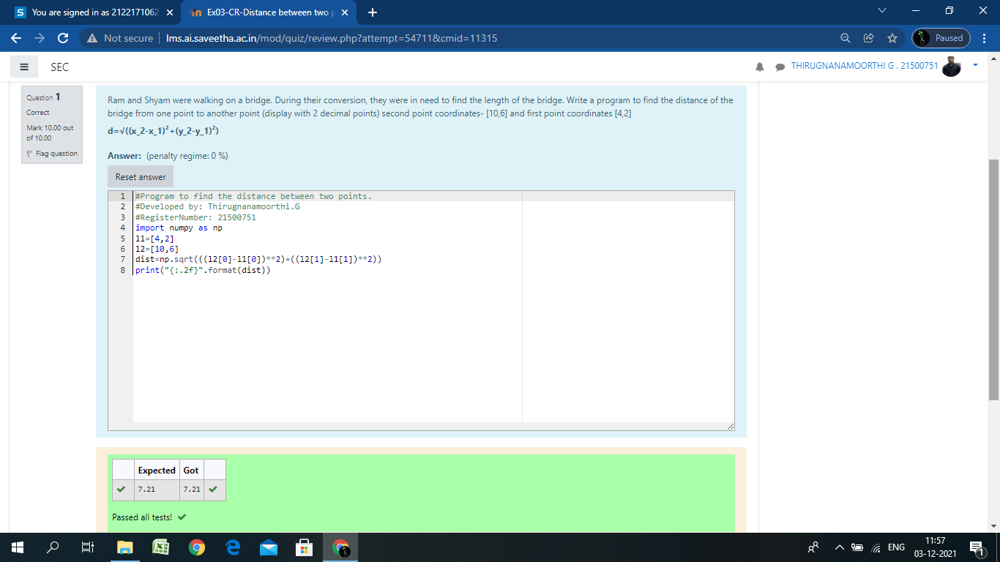

# DISTANCE-BETWEEN-TWO-POINTS

## AIM:
To write a python program to find the distance two 2 points
## ALGORITHM:

### Step 1: import math function

### Step 2: assign values to the variables

### Step 3: 
Substitute the values in the distance formula  

### Step 4:end the program 

### PROGRAM:
~~~
import numpy as np
l1=[4,2]
l2=[10,6]
dist=np.sqrt(((l2[0]-l1[0])**2)+((l2[1]-l1[1])**2))
print("{:.2f}".format(dist))
~~~
  

### OUTPUT:

### RESULT:
Thus the distance between two points are proved
